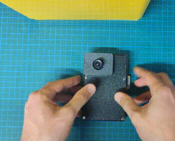
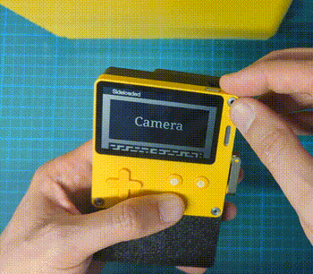

# PD-Camera project

PD-Camera is an unofficial, experimental accessory for Panic's [Playdate](https://play.date) handheld console, which as the name hopefully suggests allows the device to record pictures as well as animated gifs, in whopping  1-bit color and QVGA (320x240) resolution. Kind of like the [1998 accessory for that other monochrome handheld device](https://en.wikipedia.org/wiki/Game_Boy_Camera).

For more context on how this project came to be, you can find its devlog [on Playdate's Dev forum](https://devforum.play.date/t/playdate-oneil-camera/11043).

This repository contains the hardware and firmware of the PD-Camera accessory. The source for the companion app that runs on the Playdate itself _will eventually_ be found [here](https://github.com/t0mg/pd-camera-app).

## Overview

The Playdate can be attached to the camera accessory in three distinct configurations: **cover**, **camera**, and **selfie**.

The accessory is holding onto the Playdate with small magnets. In **camera mode**, A USB C cable plugs into the console and disappears inside a "chin" in the bottom of the accessory. In **cover mode** the Playdate can be unplugged and flipped with its screen facing backwards, in order to lay flat and protect it during transport.

The Playdate can also be fitted on the back of the accessory, without unplugging the cable, allowing to switch the camera to **selfie mode** (the companion app has a mirror optiono so it doesn't feel awkward). Additional magnets are here to secure the console in this configuration too.

## Hardware

The project is based on a [Teensy 4.1 microcontroller](https://www.pjrc.com/store/teensy41.html) that acts as a USB host to the Playdate and communicates with it over serial, including evaluating payloads in the Lua runtime (see [here](https://github.com/jaames/playdate-reverse-engineering/blob/main/usb/usb.md) for more details). The Teensy is also connected to an OV7670 camera module via its CMOS Sensor Interface (CSI) built into the IMXRT1062 MPU and using [this dedicated library](https://github.com/mjborgerson/OV7670).

A battery, custom PCB and a custom 3D-printable case complete the hardware (gerber and stl files _will eventually be_ provided in this repository).

For the detailed bill of material and assembly instructions, hop over to the [hardware folder](/hardware/).

## Firmware

To flash the Teensy microcontroller with the project's firmware, you'll need the [Teensy loader application](https://www.pjrc.com/teensy/loader.html). 

If you don't want to modify the source, you can directly grab a prebuilt `firmware.hex` file from the repository's [releases](https://github.com/t0mg/pd-camera/releases). Otherwise, read on to build your own.

### Building

This project uses [PlatformIO](https://platformio.org/) to manage dependencies and build toolchain, see [platformio.ini](platformio.ini).

The source code comprises a single, messy, [main.cpp](src/main.cpp) file which relies on the following excellent libraries:

  -	[USBHost_t36](https://github.com/PaulStoffregen/USBHost_t36) by [PaulStoffregen](https://github.com/PaulStoffregen)
  - [OV7670](https://github.com/mjborgerson/OV7670) by [mjborgerson](https://github.com/mjborgerson)
  - [dithering_halftoning](https://github.com/deeptronix/dithering_halftoning) by [deeptronix](https://github.com/deeptronix)

 ----

 Playdate is © [Panic Inc.](https://panic.com/) - this project isn't affiliated with or endorsed by them in any way (just like [that one](https://github.com/jaames/playdate-reverse-engineering))