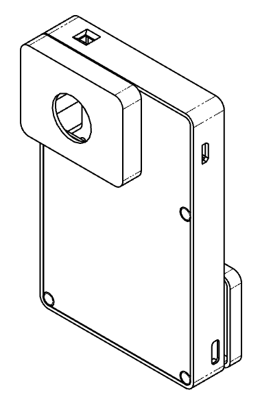
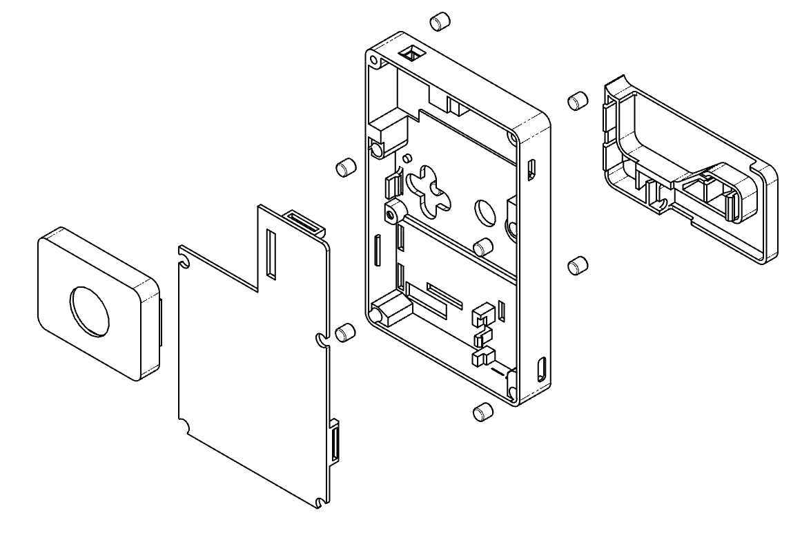

This folder contains all files and instruction necessary to build the PD-Camera hardware.

## Bill of materials

|Item| Quantity|Notes
|---|---|---|
|Custom PCB|1|Order from [JLCPCB](https://jlcpcb.com) or [OSH Park](https://oshpark.com/) see Gerber files
|Teensy 4.1 microcontroller| 1|[PJCRC store](https://www.pjrc.com/store/teensy41.html)
|OV7670 camera module|1|[Example (amazon.fr)](https://www.amazon.fr/dp/B07V1FCLXG?)
|Male headers, 24 pins |2 |0.1 inch (2.54 mm) spacing, for the Teensy
|Male headers,  4 or 5 pins |1 |0.1 inch (2.54 mm) spacing, for the Teensy's USB host port
|Female headers, 9pins | 2 | 0.1 inch (2.54 mm) spacing, for the camera module, to be cut from a standard length header
|Resistor 4k Ohm, through hole|2|
|Toggle switch SK12D07|1|
|Booster/charger USB C|1| The case is designed to fit this specific one from [aliexpress (5PCS 5V 2A USB)](https://a.aliexpress.com/_Ez5FiBT). For others you'll need to modify the 3D model before printing.
|3.7v LiPo battery|1| Should fit in the case (max size approx. 55 x 66 x 10 mm). I used a 5000 mAh battery I extracted from [this pack (amazon.fr)](https://www.amazon.fr/dp/B082PPR281).
|Neodymium magnets 5x5mm|8| Will hold the Playdate securly in place, [example (amazon.fr)](https://www.amazon.fr/dp/B00TACGMJW)
|Angled USB C to USB A cable|1|25 cm minimum; [example (amazon.fr)](https://www.amazon.fr/dp/B07H95NY5Y)
|PETG filament for the 3D printed parts 🙂|
|Some wires, solder...|
| *Optional:* CS mount & CS lenses || TODO: add references

### CS and M12 mounts

Given that OV7670 boards are so cheap, I experimented with various available mounts. The case makes it easy to swap out the entire sensor board so you could have several with each a different lens and/or mount.

Not all mounts are compatible and I had to do a bit of trial and error to find combinations of mounts and lenses that gives interesting results.

// TODO: add some refrerences here if there's interest.

## Custom PCB

In order to keep the project small and easy to assemble, I designed a small PCB (my very first one so probably terrible, but it does work) to be paired with a custom designed case (which explains its peculiar shape). 

This is the wiring implemented by the PCB, it follows the documentation from the [OV7670 library](https://github.com/mjborgerson/OV7670) the project uses.

The Gerber file for the PCB can be found [in the pcb folder](pcb/). It's 2 layer, standard thickness (1.57mm / 0.062 in). You can get one made from services such as [OSH Park](https://oshpark.com/) or [JLCPCB](https://jlcpcb.com/) for a few USD.

The large empty and seemingly useless part of the PCB is actually visible through button pockets on the face of the case, so the color you'll pick for the PCB matters. You can also customize the bottom silk screen with markings that will be visible when the Playdate is not installed!

## Electronics assembly

Before do anything, plug the Teensy to a computer via its micro USB port and make sure the LED blinks, indicating the Teensy is working correctly. You can then take this opportunity to [flash the pd-camera firmware](../README.md#firmware).

> **WARNING**: If you want to be safe, you can now cut off the copper trace pictured below so the Teensy no longer draws power from its micro USB port. This eliminates the risk for the battery power to flow back into your computer if you connect the Teensy to it (in order to e.g. update the firmware).
>
> - If you cut the trace, you'll then need to turn the battery on even when plugging the Teensy's to a computer via micro USB, but it's foolproof. 
> - If you don't cut the bridge **you must always remember to turn the battery off**, as the Teensy will be powered via its micro USB port.
>
> 
<a href="https://forum.pjrc.com/threads/70030-Teensy-4-1-Cut-pad-for-USB-location"></a/
  

### Soldering steps

Solder all male headers to the Teensy, including the 5 usb host pins. It helps to place the long headers on a breadboard to make sure the pins are straight (but you won't be able to do that with the USB Host pins because they're not aliged with the GPIO pins, so for these you can use the project's custom PCB).

Solder the 2 resistors and the toggle switch to the PCB.

Fit the Teensy flush onto the PCB, solder all pins and then cut off the protruding pins underneath, as short as possible.

Cut 2 female header bars to 9 pins each and solder them to the PCB to create a makeshift connector for the OV7670 module. Also cut off the pins underneath.

Cut the angled USB C cable at about 25cm and discard the USB A connector. Strip and solder the 4 USB wires to the PCB (*usually*, red for +5v, white for D-, green for D+, and black for GND).

Solder BATT +5v and GND from the main PCB to the +5 and GND of the power circuit PCB with short wires, and finally solder the + and - battery pads of the power circuit to your LiPo battery. You can also do (or redo) this step after assembling the case in order to optimize your wiring.

Almost done! Time to sideload the Playdate app (from [this repository](https://www.github.com/t0mg/pd-camera-app)) and test your circuit 🙂

Once you're confident with your solder joints, put your cutting pliers at work and make sure nothing protrudes underneath by more than a millimeter or so.

## 3D printed case

The case has 4 parts (body, chin, cover, camera cap) plus an optional flat spring that can help make the USB cable pop out of the chin. It was designed with OnShape (and Freecad orignally but I had to migrate).

Many iterations went into the design. The whole case could be more compact, especially with a smaller battery and fewer features. For example, without the selfie system the chin part could be reduced or removed, and the USB cable replaced with a simple dock connector. However after many iterations I decided to prioritize versatility and ergonomics over compactness.

### Printing instructions

You can find the STL files [here](/hardware/case/). All the parts can be printed in one go on a Prusa Mk3S, in PETG at 0.2mm Speed mode, default settings. They were designed to print without support if you lay each part on its flat face. These are external facing sides that take advantage of a textured print bed for a better finish.

Printing takes about 4.5 hours and 61g of filament in total.

Should you want to make changes, the entire source project is available publicly in OnShape [here](https://cad.onshape.com/documents/e21c7f87f60d07934982913d/w/b97fe7733e7e7384ebf3b9fe/e/61bb6eb626a207e4d2b47202).

## Putting it all together

### Installing the PCB

The PCB slides in and snaps without the need of any tool but it is a tight fit and requires a precise gesture and a bit of force. But don't be scared, the case is sturdy and my PETGs print survived way more assemblies and disassemblies than you should ever need to perform.

Start with the top of the PCB, fitting the little power switch through its hole in the case. Make sure the PCB is flush to the left side of the case, then lower its bottom part slowly. You'll now need to align the Teensy's USB port to the hole in the case on the right. Once it's aligned, push the PCB to the right so it gets in by a millimeter or so. Now press firmly on the PCB to snap it past the tiny leg on the right between USB and power wires, and then the snap lock on the bottom left. It's quite tight, but you can flex the edge of the case slightly outwards near the snap lock while pressing to help the PCB make it through.

### Power circit

Slide the power circuit in place at a 45 degree angle. Insert the female USB C connector into its socket, then press the back of the board to lock it in place. It should be horizontal.

### USB Cable and chin

The male USB C connector goes through a dedicated hole. Keep the cable loose at this stage.

Flip the case and take the chin piece and your Playdate. Connect it, align it with the chin and work backwards to set the length of the cable.

You can add the optional spring part by just sliding it into the chin, this little piece helps when the cable is a bit too stiff to pop out naturally, but makes the "cover mode" a bit more difficult. Either way you can easily disassemble the case to add or remove this part later.

Snap fit the chin part into the main body part then flip it back and secure the remaining part of the USB cable.

### Battery

Now is the time to install the battery and tidy all your wires inside the case. The 5000mAh battery fits (barely) under the Teensy, with its edges touching the Teensy and the right side of the connector of the camera module. 

### Cover

To put the cover, there are 3 snap fit locks to work with. First align the top one, then the right one. Finally flex the cover and push firmly on the left snap lock. To reopen the case you'd insert a spatula, blade or flat screw driver above the left snap lock and use it as a lever to free it.

### Camera module and camera cap

You can insert the OV7670 Camera module now.

The camera cap part is also press fit. It comes off easily on purpose, so you can swap the camera module if you have different lens mounts, without having to remove the cover part. Otherwise, you can add a bit of super glue to attach the camera cap to the cover plate permanently.

### Magnets

Press fit the eight neodymium magnets into their respective holes. I found that it helps to stack 2 of them to align with the hole and initiate a good vertical fit, then to flip the case and press it flush against a table to push the magnet all the way in. If they feel loose you can add a drop of superglue to secure them.

### Pat yourself in the back

Congratulation, you've built your own PD-Camera! 😊